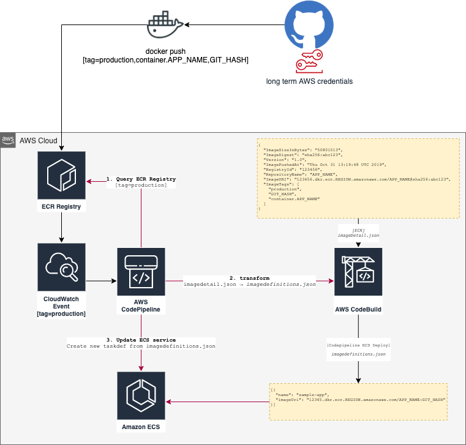

# AWS Fargate ECS Terraform Module

 [](https://registry.terraform.io/modules/stroeer/ecs-fargate/aws/0.28.0)  [](https://opensource.org/licenses/Apache-2.0)

A somewhat opinionated Terraform module to create Fargate ECS resources on AWS.

This module does the heavy lifting for:

* [ECR](https://docs.aws.amazon.com/AmazonECR/latest/userguide/Registries.html) configuration
* [automated service deployment](#Automated-service-deployment) including notifications
* CloudWatch log group and IAM permissions for storing container logs (e.g. for sidecars)
* integration with [App Mesh](https://docs.aws.amazon.com/app-mesh/latest/userguide/what-is-app-mesh.html)
  and [Application Load Balancers](#Load-Balancing)

## Requirements

The following resources are referenced from this module and therefore prerequisites:

* Subnets — within this VPC, there must be at least one subnet tagged with either `Tier = (public|private)`. The
  fargate _Elastic Network Interface_ will be placed here.
* SG (1) — within this VPC there must be a security group `Name = default`
* SG (2) — within this VPC there must be a security group to allow traffic from ALB `Name = fargate-allow-alb-traffic`
* IAM role — There should be a role named `ssm_ecs_task_execution_role` that will be used as a task execution role

### Load Balancing

`
A service can be attached to a ALB. Neither the ALB nor the Listeners are created by the module (see example app).

Sample for an service running a `HTTP` service on port `80`:

```terraform
module "service" {
  source = "..."

  target_groups = [
    {
      name             = "${local.service_name}-public"
      backend_port     = 80
      backend_protocol = "HTTP"
      target_type      = "ip"
      health_check     = {
        enabled = true
        path    = "/"
      }
    }
  ]

  https_listener_rules = [{
    listener_arn = aws_lb_listener.http.arn

    priority   = 42
    actions    = [{
      type               = "forward"
      target_group_index = 0
    }]
    conditions = [{
      path_patterns = ["/"]
      host_headers  = ["www.example.com"]
    }]
  }]
}
```

### DNS / Route53

DNS is also not part of this module and needs to be provided by the caller:

```terraform
resource "aws_route53_record" "this" {
  name    = "..."
  type    = "..."
  zone_id = "..."
}
```

this should point to your ALB. If TLS/HTTPS will be used an ACM certificate is also required.

In order to disable ALB target group attachments (e.g. for services in an App Mesh) set `target_groups = []`.

### AppAutoscaling

```terraform
module "service" {
  source = "..."

  appautoscaling_settings = {
    predefined_metric_type = "ECSServiceAverageCPUUtilization"
    target_value           = 30
    max_capacity           = 8
    min_capacity           = 2
    disable_scale_in       = true
    scale_in_cooldown      = 120
    scale_out_cooldown     = 15
  }
}
```

Use this configuration map to enable and alter the autoscaling
settings for this app.

|key|description|
|---|---|
|`target_value`| (mandatory) the target value, refers to `predefined_metric_type` |
|`predefined_metric_type`| see [docs for possible values](https://docs.aws.amazon.com/autoscaling/application/APIReference/API_PredefinedMetricSpecification.html)|
|`max_capacity`| upper threshold for scale out |
|`min_capacity`| lower threshold for scale in |
|`disable_scale_in`| prevent scale in if set to `true` |
|`scale_in_cooldown`| delay (in seconds) between scale in events |
|`scale_out_cooldown`| delay (in seconds) between scale out events |


### When using the automated deployment pipeline (optional):

* A shared S3 bucket for storing artifacts from _CodePipeline_ can be used. You can specify it through the
  variable `code_pipeline_artifact_bucket`. Otherwise a new bucket is created for every service.
* A shared `IAM::Role` for _CodePipeline_ and _CodeBuild_ can be used. You can specify those through the
  variables `code_pipeline_role_name` and `code_build_role_name`. Otherwise new roles are created for every service. For
  the permissions required see the [module code](./modules/deployment)

## Usage

Simple Fargate ECS service:

```hcl-terraform
locals {
  service_name = "example"
}

data "aws_caller_identity" "current" {}
data "aws_region" "current" {}

module "service" {
  source  = "stroeer/ecs-fargate/aws"
  version = "0.28.0"

  assign_public_ip           = true
  cluster_id                 = aws_ecs_cluster.main.id
  container_port             = 80
  create_deployment_pipeline = false
  desired_count              = 1
  service_name               = local.service_name
  vpc_id                     = module.vpc.vpc_id

  target_groups = [
    {
      name             = "${local.service_name}-public"
      backend_port     = 80
      backend_protocol = "HTTP"
      target_type      = "ip"
      health_check     = {
        enabled = true
        path    = "/"
      }
    }
  ]

  https_listener_rules = [{
    listener_arn = aws_lb_listener.http.arn

    priority   = 42
    actions    = [{
      type               = "forward"
      target_group_index = 0
    }]
    conditions = [{
      path_patterns = ["/"]
    }]
  }]

  container_definitions = jsonencode([
    {
      command: [
        "/bin/sh -c \"echo '<html> <head> <title>Hello from httpd service</title> <style>body {margin-top: 40px; background-color: #333;} </style> </head><body> <div style=color:white;text-align:center> <h1>Amazon ECS Sample App</h1> <h2>Congratulations!</h2> <p>Your application is now running on a container in Amazon ECS.</p> </div></body></html>' >  /usr/local/apache2/htdocs/index.html && httpd-foreground\""
      ],
      cpu: 256,
      entryPoint: ["sh", "-c"],
      essential: true,
      image: "httpd:2.4",
      memory: 512,
      name: local.service_name,
      portMappings: [{
        containerPort: 80
        hostPort: 80
        protocol: "tcp"
      }]
    }
  ])

  ecr = {
    image_tag_mutability         = "IMMUTABLE"
    image_scanning_configuration = {
      scan_on_push = true
    }
  }
}
```

### Naming Conventions

- Service Names `var.service_name = [a-z-]+`

## Examples

- [public-service](https://github.com/stroeer/terraform-aws-ecs-fargate/tree/main/examples/public-service)

## Documentation

Documentation is generated with `brew install terraform-docs` (
see [Makefile](https://github.com/stroeer/terraform-aws-ecs-fargate/blob/main/Makefile)).

## Terraform versions

Only Terraform 0.12+ is supported.

## Release

Release a new module version to the [Terraform registry](https://registry.terraform.io/modules/stroeer/ecs-fargate/aws/)
(`BUMP` defaults to `patch`):

```makefile
make BUMP=(major|minor|patch) release
```

## Automated Service Deployment

Once `create_deployment_pipeline` is set to `true`, we will create an automated Deployment Pipeline:



**How it works**

- You'll need AWS credentials that allow pushing images into the ECR container registry.
- Once you push an image with `[tag=production]` - a Cloudwatch Event will trigger the start of a CodePipeline
- **⚠ This tag will only trigger the pipeline. You will need a minimum of 3 tags**

1. `production` will trigger the pipeline
2. `container.$CONTAINER_NAME` is required to locate the correct container from the
   service's [task-definition.json](https://docs.aws.amazon.com/AmazonECS/latest/developerguide/create-task-definition.html)
3. One more tag that will be unique and used for the actual deployment and the task-definition.json. A good choice would
   be `git.sha`. To be specific, we chose a tag that does not `start with container.` and is none
   of `["local", "production", "staging", "infrastructure"]`

**That CodePipeline will do the heavy lifting (see deployment flow above)**

1. Pull the full `imagedefinitions.json` from the ECR registry
2. Trigger a CodeBuild to transform the `imagedefinitions.json` into a `imagedefinitions.json` for deployment
3. Update the ECS service's task-definition by replacing the specified `imageUri` for the given `name`.

**Notifications**

We will create a notification rule for the pipeline. You can provide your ARN of a notification rule target (e.g. a SNS
topic ARN) using
`codestar_notifications_target_arn`. Otherwise a new SNS topic with required permissions is created for every service.
See
[aws_codestarnotifications_notification_rule](https://www.terraform.io/docs/providers/aws/r/codestarnotifications_notification_rule.html)
for details.

You can then configure an integration between those notifications
and [AWS Chatbot](https://docs.aws.amazon.com/dtconsole/latest/userguide/notifications-chatbot.html)
for example.

## Todos

* [x] Cognito auth for ALB listeners
* [x] CodeDeploy with ECR trigger
* [ ] ECR policies
* [x] Notification for the deployment pipeline [success/failure]

<!-- BEGINNING OF PRE-COMMIT-TERRAFORM DOCS HOOK -->
## Requirements

| Name | Version |
|------|---------|
| <a name="requirement_terraform"></a> [terraform](#requirement\_terraform) | >= 1.3 |
| <a name="requirement_aws"></a> [aws](#requirement\_aws) | >= 3.0 |

## Providers

| Name | Version |
|------|---------|
| <a name="provider_aws"></a> [aws](#provider\_aws) | >= 3.0 |
| <a name="provider_terraform"></a> [terraform](#provider\_terraform) | n/a |

## Modules

| Name | Source | Version |
|------|--------|---------|
| <a name="module_code_deploy"></a> [code\_deploy](#module\_code\_deploy) | ./modules/deployment | n/a |
| <a name="module_container_definition"></a> [container\_definition](#module\_container\_definition) | Invicton-Labs/deepmerge/null | 0.1.5 |
| <a name="module_ecr"></a> [ecr](#module\_ecr) | ./modules/ecr | n/a |
| <a name="module_envoy_container_definition"></a> [envoy\_container\_definition](#module\_envoy\_container\_definition) | Invicton-Labs/deepmerge/null | 0.1.5 |
| <a name="module_fluentbit_container_definition"></a> [fluentbit\_container\_definition](#module\_fluentbit\_container\_definition) | Invicton-Labs/deepmerge/null | 0.1.5 |
| <a name="module_otel_container_definition"></a> [otel\_container\_definition](#module\_otel\_container\_definition) | Invicton-Labs/deepmerge/null | 0.1.5 |
| <a name="module_sg"></a> [sg](#module\_sg) | registry.terraform.io/terraform-aws-modules/security-group/aws | ~> 3.0 |

## Resources

| Name | Type |
|------|------|
| [aws_alb_listener_rule.public](https://registry.terraform.io/providers/hashicorp/aws/latest/docs/resources/alb_listener_rule) | resource |
| [aws_alb_target_group.main](https://registry.terraform.io/providers/hashicorp/aws/latest/docs/resources/alb_target_group) | resource |
| [aws_appautoscaling_policy.ecs](https://registry.terraform.io/providers/hashicorp/aws/latest/docs/resources/appautoscaling_policy) | resource |
| [aws_appautoscaling_target.ecs](https://registry.terraform.io/providers/hashicorp/aws/latest/docs/resources/appautoscaling_target) | resource |
| [aws_cloudwatch_log_group.containers](https://registry.terraform.io/providers/hashicorp/aws/latest/docs/resources/cloudwatch_log_group) | resource |
| [aws_ecs_service.this](https://registry.terraform.io/providers/hashicorp/aws/latest/docs/resources/ecs_service) | resource |
| [aws_ecs_task_definition.this](https://registry.terraform.io/providers/hashicorp/aws/latest/docs/resources/ecs_task_definition) | resource |
| [aws_iam_policy.acm](https://registry.terraform.io/providers/hashicorp/aws/latest/docs/resources/iam_policy) | resource |
| [aws_iam_policy.cloudwatch_logs_policy](https://registry.terraform.io/providers/hashicorp/aws/latest/docs/resources/iam_policy) | resource |
| [aws_iam_policy.otel](https://registry.terraform.io/providers/hashicorp/aws/latest/docs/resources/iam_policy) | resource |
| [aws_iam_role.ecs_task_role](https://registry.terraform.io/providers/hashicorp/aws/latest/docs/resources/iam_role) | resource |
| [aws_iam_role_policy.ecs_task_role_policy](https://registry.terraform.io/providers/hashicorp/aws/latest/docs/resources/iam_role_policy) | resource |
| [aws_iam_role_policy_attachment.acm](https://registry.terraform.io/providers/hashicorp/aws/latest/docs/resources/iam_role_policy_attachment) | resource |
| [aws_iam_role_policy_attachment.appmesh](https://registry.terraform.io/providers/hashicorp/aws/latest/docs/resources/iam_role_policy_attachment) | resource |
| [aws_iam_role_policy_attachment.cloudwatch_logs_policy](https://registry.terraform.io/providers/hashicorp/aws/latest/docs/resources/iam_role_policy_attachment) | resource |
| [aws_iam_role_policy_attachment.otel](https://registry.terraform.io/providers/hashicorp/aws/latest/docs/resources/iam_role_policy_attachment) | resource |
| [aws_security_group_rule.trusted_egress_attachment](https://registry.terraform.io/providers/hashicorp/aws/latest/docs/resources/security_group_rule) | resource |
| [aws_service_discovery_service.this](https://registry.terraform.io/providers/hashicorp/aws/latest/docs/resources/service_discovery_service) | resource |
| [aws_caller_identity.current](https://registry.terraform.io/providers/hashicorp/aws/latest/docs/data-sources/caller_identity) | data source |
| [aws_ecs_task_definition.this](https://registry.terraform.io/providers/hashicorp/aws/latest/docs/data-sources/ecs_task_definition) | data source |
| [aws_iam_policy.appmesh](https://registry.terraform.io/providers/hashicorp/aws/latest/docs/data-sources/iam_policy) | data source |
| [aws_iam_policy_document.acm](https://registry.terraform.io/providers/hashicorp/aws/latest/docs/data-sources/iam_policy_document) | data source |
| [aws_iam_policy_document.cloudwatch_logs_policy](https://registry.terraform.io/providers/hashicorp/aws/latest/docs/data-sources/iam_policy_document) | data source |
| [aws_iam_policy_document.ecs_task_assume_role_policy](https://registry.terraform.io/providers/hashicorp/aws/latest/docs/data-sources/iam_policy_document) | data source |
| [aws_iam_policy_document.nothing_is_allowed](https://registry.terraform.io/providers/hashicorp/aws/latest/docs/data-sources/iam_policy_document) | data source |
| [aws_iam_policy_document.otel](https://registry.terraform.io/providers/hashicorp/aws/latest/docs/data-sources/iam_policy_document) | data source |
| [aws_iam_role.task_execution_role](https://registry.terraform.io/providers/hashicorp/aws/latest/docs/data-sources/iam_role) | data source |
| [aws_lb.public](https://registry.terraform.io/providers/hashicorp/aws/latest/docs/data-sources/lb) | data source |
| [aws_region.current](https://registry.terraform.io/providers/hashicorp/aws/latest/docs/data-sources/region) | data source |
| [aws_subnets.selected](https://registry.terraform.io/providers/hashicorp/aws/latest/docs/data-sources/subnets) | data source |
| [terraform_remote_state.ecs](https://registry.terraform.io/providers/hashicorp/terraform/latest/docs/data-sources/remote_state) | data source |

## Inputs

| Name | Description | Type | Default | Required |
|------|-------------|------|---------|:--------:|
| <a name="input_additional_container_definitions"></a> [additional\_container\_definitions](#input\_additional\_container\_definitions) | Additional container definitions added to the task definition of this service, see https://docs.aws.amazon.com/AmazonECS/latest/developerguide/task_definition_parameters.html for allowed parameters. | `list(any)` | `[]` | no |
| <a name="input_app_mesh"></a> [app\_mesh](#input\_app\_mesh) | Configuration of optional AWS App Mesh integration using an Envoy sidecar. | <pre>object({<br>    container_definition = optional(any, {})<br>    container_name       = optional(string, "envoy")<br>    enabled              = optional(bool, false)<br>    mesh_name            = optional(string, "apps")<br><br>    tls = optional(object({<br>      acm_certificate_arn = optional(string)<br>      root_ca_arn         = optional(string)<br>    }), {})<br>  })</pre> | `{}` | no |
| <a name="input_appautoscaling_settings"></a> [appautoscaling\_settings](#input\_appautoscaling\_settings) | Autoscaling configuration for this service. | `map(any)` | `null` | no |
| <a name="input_assign_public_ip"></a> [assign\_public\_ip](#input\_assign\_public\_ip) | This services will be placed in a public subnet and be assigned a public routable IP. | `bool` | `false` | no |
| <a name="input_capacity_provider_strategy"></a> [capacity\_provider\_strategy](#input\_capacity\_provider\_strategy) | Capacity provider strategies to use for the service. Can be one or more. | <pre>list(object({<br>    capacity_provider = string<br>    weight            = string<br>    base              = optional(string, null)<br>  }))</pre> | `null` | no |
| <a name="input_cloudwatch_logs"></a> [cloudwatch\_logs](#input\_cloudwatch\_logs) | CloudWatch logs configuration for the containers of this service. CloudWatch logs will be used as the default log configuration if Firelens is disabled and for the fluentbit and otel containers. | <pre>object({<br>    enabled           = optional(bool, true)<br>    name              = optional(string, "")<br>    retention_in_days = optional(number, 7)<br>  })</pre> | `{}` | no |
| <a name="input_cluster_id"></a> [cluster\_id](#input\_cluster\_id) | The ECS cluster id that should run this service | `string` | n/a | yes |
| <a name="input_code_build_role_name"></a> [code\_build\_role\_name](#input\_code\_build\_role\_name) | Use an existing role for codebuild permissions that can be reused for multiple services. Otherwise a separate role for this service will be created. | `string` | `""` | no |
| <a name="input_code_pipeline_artifact_bucket"></a> [code\_pipeline\_artifact\_bucket](#input\_code\_pipeline\_artifact\_bucket) | Use an existing bucket for codepipeline artifacts that can be reused for multiple services. Otherwise a separate bucket for each service will be created. | `string` | `""` | no |
| <a name="input_code_pipeline_artifact_bucket_sse"></a> [code\_pipeline\_artifact\_bucket\_sse](#input\_code\_pipeline\_artifact\_bucket\_sse) | AWS KMS master key id for server-side encryption. | `any` | `{}` | no |
| <a name="input_code_pipeline_role_name"></a> [code\_pipeline\_role\_name](#input\_code\_pipeline\_role\_name) | Use an existing role for codepipeline permissions that can be reused for multiple services. Otherwise a separate role for this service will be created. | `string` | `""` | no |
| <a name="input_codestar_notifications_detail_type"></a> [codestar\_notifications\_detail\_type](#input\_codestar\_notifications\_detail\_type) | The level of detail to include in the notifications for this resource. Possible values are BASIC and FULL. | `string` | `"BASIC"` | no |
| <a name="input_codestar_notifications_event_type_ids"></a> [codestar\_notifications\_event\_type\_ids](#input\_codestar\_notifications\_event\_type\_ids) | A list of event types associated with this notification rule. For list of allowed events see https://docs.aws.amazon.com/dtconsole/latest/userguide/concepts.html#concepts-api. | `list(string)` | <pre>[<br>  "codepipeline-pipeline-pipeline-execution-succeeded",<br>  "codepipeline-pipeline-pipeline-execution-failed"<br>]</pre> | no |
| <a name="input_codestar_notifications_kms_master_key_id"></a> [codestar\_notifications\_kms\_master\_key\_id](#input\_codestar\_notifications\_kms\_master\_key\_id) | AWS KMS master key id for server-side encryption. | `string` | `null` | no |
| <a name="input_codestar_notifications_target_arn"></a> [codestar\_notifications\_target\_arn](#input\_codestar\_notifications\_target\_arn) | Use an existing ARN for a notification rule target (for example, a SNS Topic ARN). Otherwise a separate sns topic for this service will be created. | `string` | `""` | no |
| <a name="input_container_definition_overwrites"></a> [container\_definition\_overwrites](#input\_container\_definition\_overwrites) | Additional container definition parameters or overwrites of defaults for your service, see https://docs.aws.amazon.com/AmazonECS/latest/developerguide/task_definition_parameters.html for allowed parameters. | `any` | `{}` | no |
| <a name="input_container_name"></a> [container\_name](#input\_container\_name) | Defaults to var.service\_name, can be overridden if it differs. Used as a target for LB. | `string` | `""` | no |
| <a name="input_container_port"></a> [container\_port](#input\_container\_port) | The port used by the app within the container. | `number` | n/a | yes |
| <a name="input_cpu"></a> [cpu](#input\_cpu) | Amount of CPU required by this service. 1024 == 1 vCPU | `number` | `256` | no |
| <a name="input_create_deployment_pipeline"></a> [create\_deployment\_pipeline](#input\_create\_deployment\_pipeline) | Creates a deploy pipeline from ECR trigger if `create_ecr_repo == true`. | `bool` | `true` | no |
| <a name="input_create_ecr_repository"></a> [create\_ecr\_repository](#input\_create\_ecr\_repository) | Create an ECR repository for this service. | `bool` | `true` | no |
| <a name="input_create_ingress_security_group"></a> [create\_ingress\_security\_group](#input\_create\_ingress\_security\_group) | Create a security group allowing ingress from target groups to the application ports. Disable this for target groups attached to a Network Loadbalancer. | `bool` | `true` | no |
| <a name="input_deployment_circuit_breaker"></a> [deployment\_circuit\_breaker](#input\_deployment\_circuit\_breaker) | Deployment circuit breaker configuration. | <pre>object({<br>    enable   = bool<br>    rollback = bool<br>  })</pre> | <pre>{<br>  "enable": false,<br>  "rollback": false<br>}</pre> | no |
| <a name="input_deployment_maximum_percent"></a> [deployment\_maximum\_percent](#input\_deployment\_maximum\_percent) | Upper limit (as a percentage of the service's desiredCount) of the number of running tasks that can be running in a service during a deployment. Not valid when using the `DAEMON` scheduling strategy. | `number` | `200` | no |
| <a name="input_deployment_minimum_healthy_percent"></a> [deployment\_minimum\_healthy\_percent](#input\_deployment\_minimum\_healthy\_percent) | Lower limit (as a percentage of the service's desiredCount) of the number of running tasks that must remain running and healthy in a service during a deployment. | `number` | `100` | no |
| <a name="input_desired_count"></a> [desired\_count](#input\_desired\_count) | Desired count of services to be started/running. | `number` | `0` | no |
| <a name="input_ecr_custom_lifecycle_policy"></a> [ecr\_custom\_lifecycle\_policy](#input\_ecr\_custom\_lifecycle\_policy) | JSON formatted ECR lifecycle policy used for this repository (disabled the default lifecycle policy), see https://docs.aws.amazon.com/AmazonECR/latest/userguide/LifecyclePolicies.html#lifecycle_policy_parameters for details. | `string` | `null` | no |
| <a name="input_ecr_enable_default_lifecycle_policy"></a> [ecr\_enable\_default\_lifecycle\_policy](#input\_ecr\_enable\_default\_lifecycle\_policy) | Enables an ECR lifecycle policy for this repository which expires all images except for the last 30. | `bool` | `true` | no |
| <a name="input_ecr_force_delete"></a> [ecr\_force\_delete](#input\_ecr\_force\_delete) | If `true`, will delete this repository even if it contains images. | `bool` | `false` | no |
| <a name="input_ecr_image_scanning_configuration"></a> [ecr\_image\_scanning\_configuration](#input\_ecr\_image\_scanning\_configuration) | n/a | `map(any)` | <pre>{<br>  "scan_on_push": true<br>}</pre> | no |
| <a name="input_ecr_image_tag_mutability"></a> [ecr\_image\_tag\_mutability](#input\_ecr\_image\_tag\_mutability) | n/a | `string` | `"MUTABLE"` | no |
| <a name="input_ecr_repository_name"></a> [ecr\_repository\_name](#input\_ecr\_repository\_name) | Existing repo to register to use with this service module, e.g. creating deployment pipelines. | `string` | `""` | no |
| <a name="input_efs_volumes"></a> [efs\_volumes](#input\_efs\_volumes) | Configuration block for EFS volumes. | `any` | `[]` | no |
| <a name="input_enable_execute_command"></a> [enable\_execute\_command](#input\_enable\_execute\_command) | Specifies whether to enable Amazon ECS Exec for the tasks within the service. | `bool` | `false` | no |
| <a name="input_firelens"></a> [firelens](#input\_firelens) | Configuration for optional custom log routing using FireLens over fluentbit sidecar. | <pre>object({<br>    container_definition = optional(any, {})<br>    enabled              = optional(bool, false)<br>    opensearch_host      = optional(string, "")<br>  })</pre> | `{}` | no |
| <a name="input_force_new_deployment"></a> [force\_new\_deployment](#input\_force\_new\_deployment) | Enable to force a new task deployment of the service. This can be used to update tasks to use a newer Docker image with same image/tag combination (e.g. myimage:latest), roll Fargate tasks onto a newer platform version, or immediately deploy ordered\_placement\_strategy and placement\_constraints updates. | `bool` | `false` | no |
| <a name="input_https_listener_rules"></a> [https\_listener\_rules](#input\_https\_listener\_rules) | A list of maps describing the Listener Rules for this ALB. Required key/values: actions, conditions. Optional key/values: priority, https\_listener\_index (default to https\_listeners[count.index]) | `any` | `[]` | no |
| <a name="input_memory"></a> [memory](#input\_memory) | Amount of memory [MB] is required by this service. | `number` | `512` | no |
| <a name="input_otel"></a> [otel](#input\_otel) | Configuration for (optional) AWS Distro für OpenTelemetry sidecar. | <pre>object({<br>    container_definition = optional(any, {})<br>    enabled              = optional(bool, false)<br>  })</pre> | `{}` | no |
| <a name="input_platform_version"></a> [platform\_version](#input\_platform\_version) | The platform version on which to run your service. Defaults to LATEST. | `string` | `"LATEST"` | no |
| <a name="input_policy_document"></a> [policy\_document](#input\_policy\_document) | AWS Policy JSON describing the permissions required for this service. | `string` | `""` | no |
| <a name="input_requires_compatibilities"></a> [requires\_compatibilities](#input\_requires\_compatibilities) | The launch type the task is using. This enables a check to ensure that all of the parameters used in the task definition meet the requirements of the launch type. | `set(string)` | <pre>[<br>  "EC2",<br>  "FARGATE"<br>]</pre> | no |
| <a name="input_requires_internet_access"></a> [requires\_internet\_access](#input\_requires\_internet\_access) | As Fargate does not support IPv6 yet, this is the only way to enable internet access for the service by placing it in a public subnet (but not assigning a public IP). | `bool` | `false` | no |
| <a name="input_security_groups"></a> [security\_groups](#input\_security\_groups) | A list of security group ids that will be attached additionally to the ecs deployment. | `list(string)` | `[]` | no |
| <a name="input_service_name"></a> [service\_name](#input\_service\_name) | The service name. Will also be used as Route53 DNS entry. | `string` | n/a | yes |
| <a name="input_subnet_tags"></a> [subnet\_tags](#input\_subnet\_tags) | The subnet tags where the ecs service will be deployed. If not specified all subnets will be used. | `map(string)` | `null` | no |
| <a name="input_tags"></a> [tags](#input\_tags) | Additional tags (\_e.g.\_ { map-migrated : d-example-443255fsf }) | `map(string)` | `{}` | no |
| <a name="input_target_groups"></a> [target\_groups](#input\_target\_groups) | A list of maps containing key/value pairs that define the target groups to be created. Order of these maps is important and the index of these are to be referenced in listener definitions. Required key/values: name, backend\_protocol, backend\_port | `any` | `[]` | no |
| <a name="input_task_role_arn"></a> [task\_role\_arn](#input\_task\_role\_arn) | ARN of the IAM role that allows your Amazon ECS container task to make calls to other AWS services. If not specified, the default ECS task role created in this module will be used. | `string` | `""` | no |
| <a name="input_vpc_id"></a> [vpc\_id](#input\_vpc\_id) | VPC id where the load balancer and other resources will be deployed. | `string` | n/a | yes |

## Outputs

| Name | Description |
|------|-------------|
| <a name="output_autoscaling_target"></a> [autoscaling\_target](#output\_autoscaling\_target) | ECS auto scaling targets if auto scaling enabled. |
| <a name="output_aws_alb_target_group_arns"></a> [aws\_alb\_target\_group\_arns](#output\_aws\_alb\_target\_group\_arns) | ARNs of the created target groups. |
| <a name="output_cloudwatch_log_group"></a> [cloudwatch\_log\_group](#output\_cloudwatch\_log\_group) | Name of the CloudWatch log group for container logs. |
| <a name="output_container_definitions"></a> [container\_definitions](#output\_container\_definitions) | Container definitions used by this service including all sidecars. |
| <a name="output_ecr_repository_arn"></a> [ecr\_repository\_arn](#output\_ecr\_repository\_arn) | Full ARN of the ECR repository. |
| <a name="output_ecr_repository_url"></a> [ecr\_repository\_url](#output\_ecr\_repository\_url) | URL of the ECR repository. |
| <a name="output_ecs_task_exec_role_arn"></a> [ecs\_task\_exec\_role\_arn](#output\_ecs\_task\_exec\_role\_arn) | The ARN of the ECS task role created for this service. |
| <a name="output_ecs_task_exec_role_name"></a> [ecs\_task\_exec\_role\_name](#output\_ecs\_task\_exec\_role\_name) | The name of the ECS task role created for this service. |
| <a name="output_ecs_task_exec_role_unique_id"></a> [ecs\_task\_exec\_role\_unique\_id](#output\_ecs\_task\_exec\_role\_unique\_id) | The unique id of the ECS task role created for this service. |
| <a name="output_target_group_arns"></a> [target\_group\_arns](#output\_target\_group\_arns) | ARNs of the created target groups. |
<!-- END OF PRE-COMMIT-TERRAFORM DOCS HOOK -->
